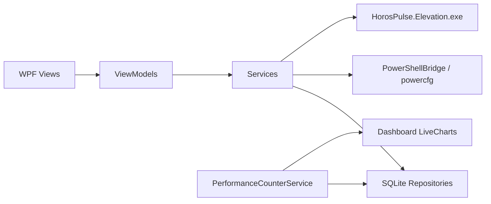
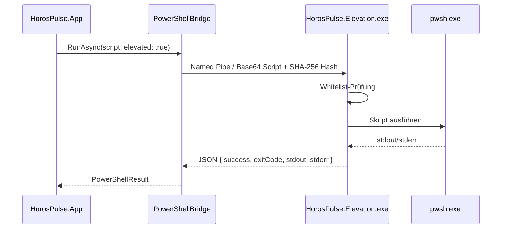

# Architektur

## Solution-Struktur

```
HorosPulse.sln
├── src/
│   ├── HorosPulse.App          # WPF-Shell, DI-Host, Navigation, Themes
│   ├── HorosPulse.ViewModels   # MVVM ViewModels
│   ├── HorosPulse.Services     # Domänenlogik, IOptimizationModule-Implementierungen
│   ├── HorosPulse.Core         # Interfaces, Modelle, Skript-Bibliothek
│   ├── HorosPulse.Data         # SQLite (Microsoft.Data.Sqlite), Repositories
│   └── HorosPulse.Elevation    # HorosPulse.Elevation.exe (requireAdministrator)
└── tests/
    ├── HorosPulse.Tests.Unit
    └── HorosPulse.Tests.Integration
```

## Datenfluss



1. **UI** bindet an ViewModels (CommunityToolkit.Mvvm).
2. **ViewModels** rufen Service-Interfaces auf — keine direkte Registry/PowerShell-Logik in der UI-Schicht.
3. **Services** orchestrieren Module (`IOptimizationModule`), Snapshots und Audit-Logging.
4. **Data** persistiert Snapshots, Audit-Einträge (append-only) und Metrik-Zeitreihen unter `%LOCALAPPDATA%\HorosPulse\`.


## Elevation-Binary (Namenskonvention)

| Bezeichnung | Bedeutung |
|-------------|-----------|
| **HorosPulse.Elevation.exe** | Tatsächlicher Build- und Publish-Dateiname (Projekt HorosPulse.Elevation) |
| **Elevation helper** / ElevationHelper* in Code | Konzept bzw. Typen wie ElevationHelperPathResolver — **nicht** der Dateiname auf der Festplatte |

Frühere Docs nannten die EXE fälschlich HorosPulse.Elevation.exe; Build (CopyElevationHelper-Target), publish.ps1 und ElevationHelperPathResolver.HelperFileName verwenden durchgängig HorosPulse.Elevation.exe.

## Elevation-Flow



- Die Haupt-App läuft **niemals** als Administrator (`asInvoker`).
- Nur `HorosPulse.Elevation.exe` fordert UAC an und führt whitelisted Skripte aus.
- Defender-, Indexer- und WSearch-Operationen nutzen diesen Pfad.

## Installer / Updates

- **Portable ZIP:** `publish.ps1` (MVP-Distribution)
- **Velopack (Phase 3):** `VelopackApp.Build().Run()` in `App.xaml.cs` — Auto-Update gegen Release-Server via `vpk pack` (siehe `publish.ps1` Kommentare)
- **Deinstallation:** App-Daten in `%LOCALAPPDATA%\HorosPulse\` — Rollback aller Optimierungen optional vor Löschen (Einstellungen-Dokumentation)

## ML-Pipeline (lokal)

Historische `performance_metrics` aus SQLite → `MetricsAnomalyService` (ML.NET IID Spike) → `RecommendationEngine` (regelbasiert + Anomalie-Kontext) → Dashboard-Panel.

Keine Cloud-Daten; Training und Inferenz erfolgen auf dem lokalen Rechner.
