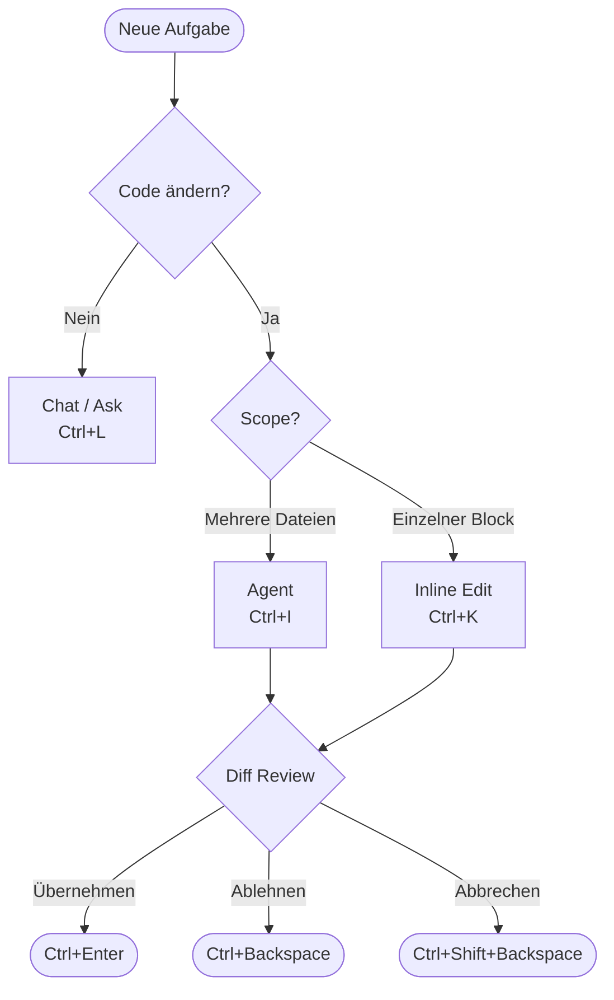

# Cursor Shortcuts — Architektur & Interaktionsmodell

> **Diataxis: Explanation** · Stand: 2026-07-06

---

## Die drei Interaktionspfade

Cursor bietet drei distinkte Wege, mit dem KI-Modell zu interagieren. Jeder hat eigene Shortcuts, einen eigenen Scope und ein eigenes Persistenzmodell.

```
┌─────────────────────────────────────────────────────────────┐
│                    Cursor IDE (Windows)                      │
│                                                              │
│   Ctrl+I              Ctrl+L              Ctrl+K             │
│      │                   │                   │              │
│      ▼                   ▼                   ▼              │
│  ┌────────┐         ┌─────────┐        ┌───────────┐       │
│  │ Agent  │         │  Chat   │        │  Inline   │       │
│  │ Panel  │         │ (Ask)   │        │  Edit     │       │
│  └────────┘         └─────────┘        └───────────┘       │
│  Mehrstufig         Konversation        Selektion-          │
│  Dateischreibend    Schreibgeschützt    gebunden            │
│                                                              │
│  Ctrl+Enter = Übernehmen / Ablehnen = Ctrl+Backspace        │
└─────────────────────────────────────────────────────────────┘
```

---

## Entscheidungsbaum: Welchen Modus wählen?

```
Aufgabe beginnen
      │
      ▼
Soll Code verändert werden?
      │
   Ja ├──────────────────────────────────────────────┐
      │                                               │
      ▼                                               ▼
Mehrere Dateien / komplex?                  Einzelner Block / einfach?
      │                                               │
   Ja ├─► Agent (Ctrl+I)                           Ja ├─► Inline Edit (Ctrl+K)
      │                                               │
   Nein ▼                                          Nein ▼
   Nur Erklärung / Frage?                          Chat Ask (Ctrl+L)
      │
   Ja ├─► Chat Ask (Ctrl+L)
```

---

## Datenfluss: Agent-Session

```
Nutzer          Agent Panel         LLM-Backend         Dateisystem
  │                   │                   │                  │
  │── Ctrl+I ────────►│                   │                  │
  │── Prompt + @refs─►│                   │                  │
  │                   │── Kontext ────────►│                  │
  │                   │                   │── Lesen ─────────►│
  │                   │◄── Vorschlag ──────│                  │
  │◄── Diff anzeigen ─│                   │                  │
  │── Ctrl+Enter ────►│                   │                  │
  │                   │── Schreiben ──────────────────────────►│
  │                   │                   │                  │
  │── Ctrl+Backspace─►│ (Revert)          │                  │
```

---

## Datenfluss: Inline Edit

```
Nutzer          Editor              Inline Bar          LLM-Backend
  │                │                    │                   │
  │── Markieren ──►│                    │                   │
  │── Ctrl+K ─────────────────────────►│                   │
  │── Prompt ─────────────────────────►│                   │
  │                │                   │── Selektion + ────►│
  │                │                   │   Kontext          │
  │                │◄── Diff ──────────│◄── Antwort ────────│
  │── Ctrl+Enter──►│ (Apply)            │                   │
  │── Escape ─────►│ (Reject)           │                   │
```

---

## Persistenz-Modell

| Modus | Persistenz | Wieder öffnen |
|-------|-----------|---------------|
| Agent | Session bleibt gespeichert | `Ctrl+R` → Recent Chats |
| Chat/Ask | Session bleibt gespeichert | `Ctrl+R` → Recent Chats |
| Inline Edit | Einmalig, kein Session-Speicher | — |

`Ctrl+N` startet immer eine neue, leere Session (für Agent und Chat gleichermaßen).

---

## Modus-Rotation mit `Shift+Tab`

Im geöffneten Panel rotiert `Shift+Tab` durch:

```
Agent ──► Ask ──► Manual ──► (zurück zu Agent)
```

`Ctrl+.` öffnet das Auswahl-Menü ohne Rotation — nützlich wenn der Zielmodus nicht der nächste in der Rotation ist.

---

## Shortcut-Kontext: `when`-Klauseln

Cursor-Shortcuts sind kontextabhängig. Die relevanten `when`-Klauseln aus der VS-Code-Engine:

| Kontext | Beschreibung |
|---------|-------------|
| `editorTextFocus` | Cursor befindet sich im Text-Editor |
| `inCursorChat` | Fokus ist im Chat/Agent-Panel |
| `inlineEditContext` | Inline-Edit-Leiste ist aktiv |
| `!editorReadonly` | Editor ist beschreibbar |

Diese Klauseln sind in `keybindings.json` verwendbar, um Shortcuts kontextspezifisch zu überschreiben.

---

## Mermaid: Modi-Fluss



*(Das interaktive Mermaid-Diagramm ist in [index.html](index.html) eingebettet.)*
