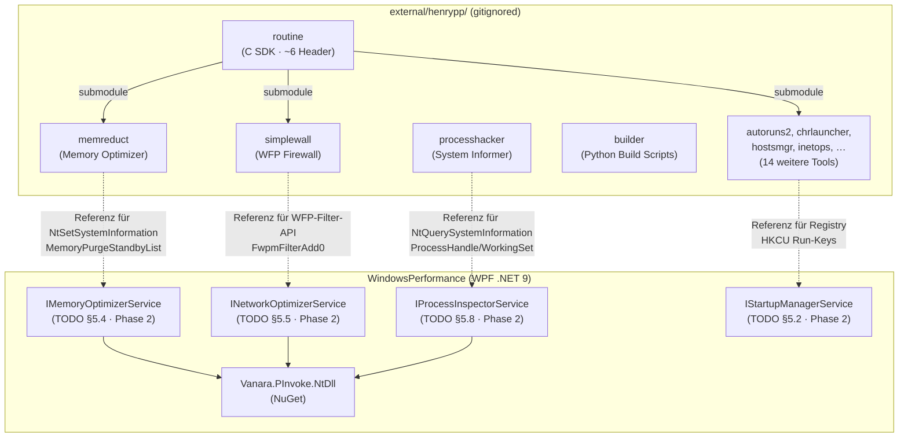
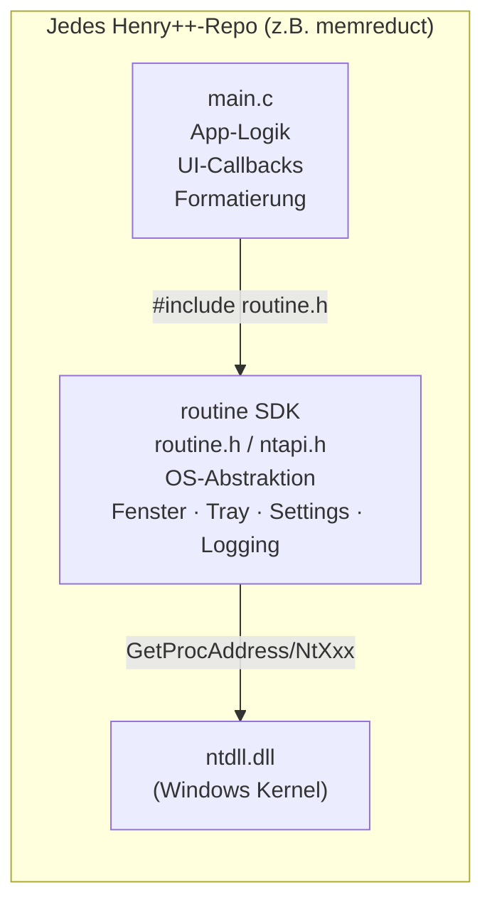
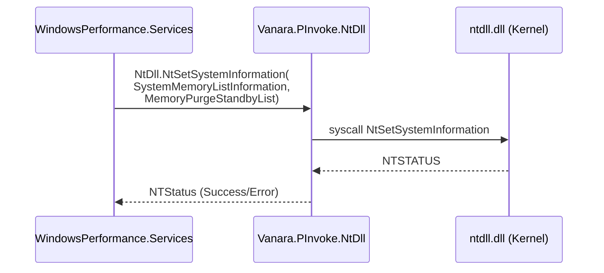
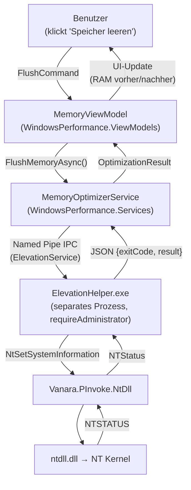

# Henry++ Referenz-Bibliothek — Architektur & Integration

> **Diataxis: Erklärung** · Stand: 2026-07-06  
> Wie die Henry++-Repos intern aufgebaut sind, wie sie zueinander stehen und wie ihre Konzepte nach WindowsPerformance übertragen werden.

---

## Repo-Beziehungsdiagramm

---

## Henry++-interne Architektur

### Schichtenmodell

Jedes Henry++-Projekt folgt demselben zweischichtigen Modell:

- **`main.c`** enthält die gesamte App-spezifische Logik (oft 3 000–8 000 Zeilen in einer Datei)
- **`routine`** liefert alle Windows-API-Abstraktion, Logging, INI-Konfiguration, Fensterverwaltung
- **`ntdll.dll`** ist die unterste Ebene — NT-Kernel-Calls, die direkt die Kernel-ABI ansprechen

---

## Übertragung nach WindowsPerformance

### Das Prinzip: Gleiche NT-API, andere Sprache

Henry++-Code ruft `NtSetSystemInformation` direkt aus C auf. WindowsPerformance nutzt dasselbe API über `Vanara.PInvoke.NtDll`:

**Wichtig:** `NtSetSystemInformation` mit `SystemMemoryListInformation` erfordert das Privilege `SeProfileSingleProcessPrivilege`. In WindowsPerformance wird dies über `ElevationHelper.exe` (UAC on-demand) gehandhabt, nicht durch dauerhaftes `requireAdministrator`.

---

## Integration in WindowsPerformance — Datenfluss

---

## Kontrast: Henry++ UAC vs. WindowsPerformance UAC

| Aspekt | Henry++ (z.B. memreduct) | WindowsPerformance |
|--------|--------------------------|-------------------|
| Elevation-Strategie | App startet mit `requireAdministrator`-Manifest — immer als Admin | `app.manifest`: `asInvoker`; nur `ElevationHelper.exe` hat Admin-Manifest |
| Laufzeit | Dauerhaft als Admin | Admin nur für die Dauer der Operation |
| Security-Prinzip | Vereinfachte Entwicklung; für Desktop-Tools akzeptabel | Principle of Least Privilege; keine dauerhaft erhöhten Rechte |

---

## Beziehung `routine` → Windows NT Headers (phnt)

`routine/src/ntapi.h` ist funktional äquivalent zu den [Process Hacker NT Headers (phnt)](https://github.com/winsiderss/phnt). Beide definieren undokumentierte NT-Strukturen, die nicht im offiziellen Windows SDK enthalten sind.

| Quelle | Pfad in `external/` | Äquivalent |
|--------|--------------------|-----------:|
| `routine/src/ntapi.h` | `external/henrypp/routine/src/ntapi.h` | Eigene Henry++ NT-Header |
| phnt (System Informer) | `external/henrypp/processhacker/phnt/` | Umfangreichere Community-NT-Header |

Beide sind nutzbar als Quellenreferenz für NT-Typen. `Vanara.PInvoke.NtDll` verwendet intern ebenfalls phnt-kompatible Definitionen.

---

## Nicht-Integriertes (Explizit)

Die folgenden Integrationsmuster existieren **nicht** und sind **nicht geplant**:

| Was | Warum nicht |
|-----|------------|
| C-Code von `routine` in WindowsPerformance kompilieren | .NET 9 hat keinen C-Kompilierungsschritt; P/Invoke via Vanara ist der richtige Weg |
| Henry++-DLLs als Runtime-Dependency | Unnötige Deployment-Komplexität; Vanara deckt alles ab |
| `memreduct.exe` oder `simplewall.exe` als Child-Process starten | Keine Kontrolle über externe Prozesse; eigene Service-Implementierung ist sicherer |
| `external/henrypp/` in `WindowsPerformance.sln` einbinden | Die Repos sind C/MSVC-Projekte; inkompatibel mit `dotnet`/MSBuild-Projektformat |

---

## Verlinkungen

- NT-API-Typen und Signaturen: [05-api-datenmodell.md](05-api-datenmodell.md)
- Klonreihenfolge und Submodule: [02-benutzer-anleitung.md](02-benutzer-anleitung.md)
- Repo-Inventar: [03-einstellungen.md](03-einstellungen.md)
- Elevation-Architektur in WindowsPerformance: [`TODO.md §2.3`](../../TODO.md)
