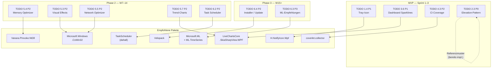
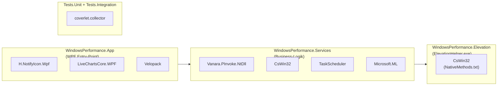

# Architektur: TODO-Phasen → Empfohlene Repos

> **Typ:** Erklärung (Diataxis)  
> **Zielgruppe:** Entwickler, die Abhängigkeiten in den Solution-Kontext einordnen wollen

---

## Überblick

Die empfohlenen Pakete greifen an klar abgegrenzten Stellen in die Solution-Schichten ein. Kein Paket querverbindet mehrere Schichten ohne Abstraktionsgrenze. Die folgende Karte zeigt, wie TODO-Phasen zu Paketen und Pakete zu Solution-Projekten passen.

---

## Phasen-zu-Repos-Diagramm



---

## Solution-Schichten-Mapping



---

## Abhängigkeitsketten

### Tray-Icon (MVP)

```
App.xaml (TaskbarIcon-Ressource)
  └── H.NotifyIcon.Wpf
        └── Windows Shell NotifyIcon API
```

Keine Service-Abhängigkeit. Das Tray-Icon hängt direkt am WPF-Application-Lifecycle.

---

### Sparklines / Trends (MVP → Phase 2)

```
DashboardView.xaml (CartesianChart)
  └── LiveChartsCore.SkiaSharpView.WPF
        └── SkiaSharp (transitiv)
              └── PerformanceCounterService.MetricUpdated (Event)
                    └── DashboardViewModel.CpuSeries (ObservableCollection<double>)
```

Die Chart-Library empfängt nur Daten — sie hat keine Kenntnis von der Datenquelle. `DashboardViewModel` entkoppelt beide Seiten.

---

### Memory Optimizer (Phase 2)

```
MemoryOptimizerService.PurgeStandbyListAsync()
  └── Vanara.PInvoke.NtDll.NtSetSystemInformation
        └── SYSTEM_MEMORY_LIST_COMMAND.MemoryPurgeStandbyList
              └── ElevationHelper.exe (Named Pipe IPC)
                    └── requireAdministrator-Manifest
```

> `NtSetSystemInformation` erfordert `SE_INCREASE_QUOTA_PRIVILEGE`. Die Operation läuft deshalb **immer** durch den Elevation-Helper, nicht direkt im App-Prozess.

---

### CsWin32 (Phase 2, compile-time)

```
NativeMethods.txt (im Projekt)
  └── Microsoft.Windows.CsWin32 (Source-Generator)
        └── Generated/NativeMethods.g.cs (zur Kompilierzeit)
              └── Verwendung in Services / Elevation
```

CsWin32 hinterlässt **keinen Runtime-Footprint** — der Generator läuft nur beim Build. Die generierten Methoden sind typsichere `static extern`-Stubs.

---

### Task-Scheduler (Phase 2)

```
TaskSchedulerService
  └── TaskScheduler (dahall) — COM-Wrapper für ITaskService
        └── Windows Task Scheduler COM API
              └── ElevationHelper (für HKLM-Tasks, die Admin-Rechte benötigen)
```

HKCU-Startup-Einträge (eigene Tasks des Benutzers) können ohne Elevation gelesen und deaktiviert werden. HKLM-Tasks erfordern Elevation.

---

### Installer / Update (Phase 3)

```
Velopack CLI (vpk pack) → Release-Bundle
  └── Velopack NuGet in App.xaml.cs (VelopackApp.Build().Run())
        └── Update-Check gegen Release-Server (HTTPS)
              └── Delta-Update downloaden + nächsten Start vorbereiten
```

---

## Was sich durch externe Pakete NICHT ändert

- **Elevation-Architektur:** `ElevationHelper.exe` als separater Prozess bleibt — Vanara und CsWin32 ändern *wie* P/Invoke-Calls aussehen, nicht *wo* sie ausgeführt werden.
- **Snapshot/Rollback:** Kein externes Paket greift in den Snapshot-Mechanismus ein. `SnapshotManager` und `RollbackEngine` bleiben rein intern.
- **DI-Container:** `Microsoft.Extensions.Hosting` bleibt der alleinige DI-Container. Die externen Pakete registrieren sich als normale Services.
- **SQLite-Persistenz:** `Microsoft.Data.Sqlite` bleibt der Datenbank-Treiber. ML.NET liest Daten aus dem bestehenden `IPerformanceMetricRepository` — es bekommt kein eigenes Datenbank-Zugriffs-Layer.
